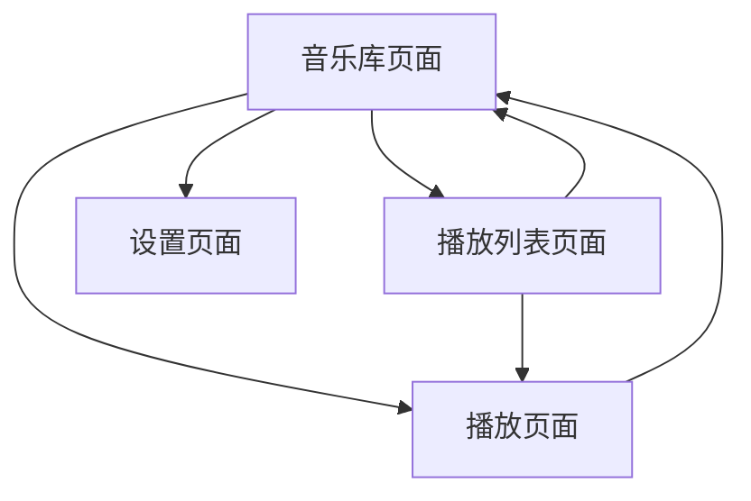

## 1. 产品概述
基于Android平台的本地音乐播放器应用，专注于提供简洁高效的音乐播放体验。支持本地音乐文件管理、播放列表创建、以及基本的播放控制功能。

目标用户：Android设备用户，需要一款轻量级、易用的本地音乐播放工具。

## 2. 核心功能

### 2.1 用户角色
| 角色 | 注册方式 | 核心权限 |
|------|----------|----------|
| 普通用户 | 无需注册 | 浏览音乐库、创建播放列表、播放音乐 |

### 2.2 功能模块
音乐播放器包含以下主要页面：
1. **音乐库页面**：显示本地音乐文件列表，支持搜索和筛选
2. **播放页面**：显示当前播放音乐信息，提供播放控制
3. **播放列表页面**：管理自定义播放列表
4. **设置页面**：应用基本设置选项

### 2.3 页面详情
| 页面名称 | 模块名称 | 功能描述 |
|----------|----------|----------|
| 音乐库页面 | 音乐列表 | 显示设备中所有音频文件，包含歌曲名、艺术家、时长信息 |
| 音乐库页面 | 搜索功能 | 支持按歌曲名、艺术家名搜索音乐 |
| 音乐库页面 | 分类筛选 | 按专辑、艺术家分类显示音乐 |
| 播放页面 | 播放控制 | 播放/暂停、上一首、下一首、进度条控制 |
| 播放页面 | 信息显示 | 显示当前歌曲封面、标题、艺术家、专辑信息 |
| 播放页面 | 播放模式 | 支持单曲循环、列表循环、随机播放模式切换 |
| 播放列表页面 | 列表管理 | 创建、编辑、删除自定义播放列表 |
| 播放列表页面 | 歌曲管理 | 向播放列表添加/移除歌曲，调整歌曲顺序 |
| 设置页面 | 基本设置 | 主题切换、音质选择、扫描目录设置 |

## 3. 核心流程

### 用户主要操作流程：
1. **首次使用**：应用自动扫描设备音乐文件 → 显示音乐库 → 用户选择歌曲播放
2. **日常播放**：浏览音乐库 → 点击歌曲 → 进入播放页面 → 控制播放
3. **播放列表管理**：进入播放列表页面 → 创建新列表 → 添加歌曲 → 保存列表

## 4. 用户界面设计

### 4.1 设计风格
- **主色调**：深蓝色渐变 (#1E3A8A 到 #3B82F6)
- **辅助色**：白色背景，灰色文字 (#6B7280)
- **按钮样式**：圆角矩形，扁平化设计
- **字体**：系统默认字体，标题18sp，正文14sp
- **图标风格**：Material Design 线性图标

### 4.2 页面设计概览
| 页面名称 | 模块名称 | UI元素 |
|----------|----------|----------|
| 音乐库页面 | 音乐列表 | 卡片式布局，每行显示歌曲信息，左侧封面缩略图，右侧歌曲详情 |
| 播放页面 | 播放控制 | 底部固定播放栏，包含播放/暂停按钮、进度条、歌曲基本信息 |
| 播放列表页面 | 列表管理 | 列表视图显示所有播放列表，支持长按编辑和滑动删除 |
| 设置页面 | 基本设置 | 分组列表样式，开关控件用于功能切换 |

### 4.3 响应式设计
- **移动端优先**：专为Android手机设计
- **屏幕适配**：支持不同屏幕尺寸，最小宽度360dp
- **触摸优化**：按钮最小点击区域48dp，支持滑动操作