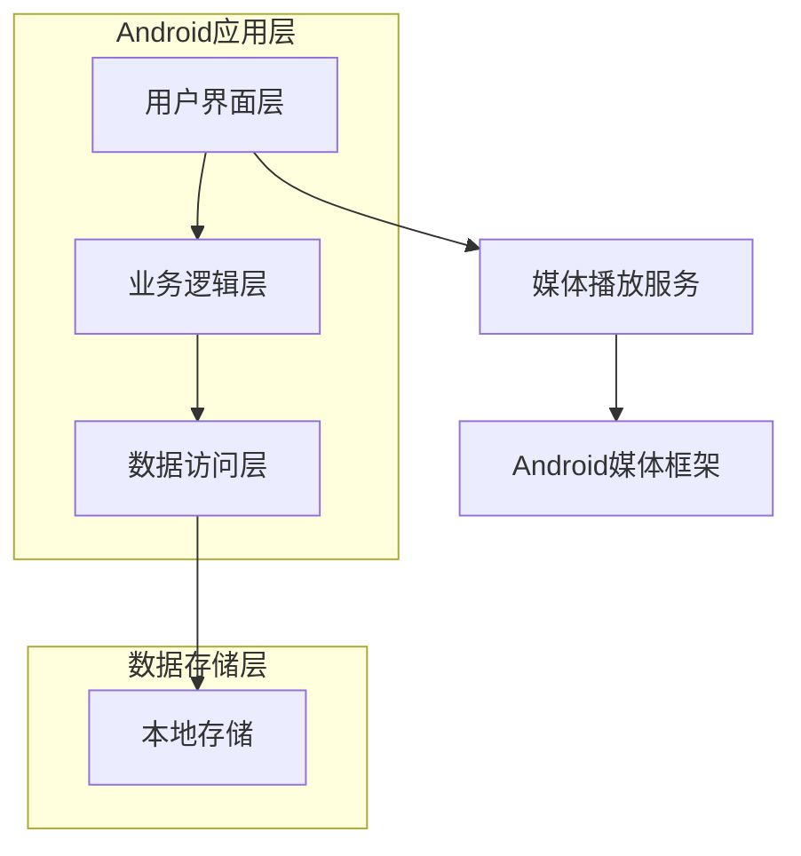

## 1. 架构设计



## 2. 技术描述

- **平台**：Android (Kotlin)
- **UI框架**：Jetpack Compose + Material Design 3
- **构建工具**：Gradle with Kotlin DSL
- **最低SDK版本**：API 24 (Android 7.0)
- **目标SDK版本**：API 34 (Android 14)

### 核心依赖库：
- **媒体播放**：ExoPlayer (com.google.android.exoplayer:exoplayer:2.19.1)
- **依赖注入**：Hilt (androidx.hilt:hilt-navigation-compose:1.0.0)
- **协程支持**：kotlinx-coroutines-android:1.7.3
- **生命周期管理**：androidx.lifecycle:lifecycle-runtime-ktx:2.6.2

## 3. 模块架构

### 3.1 模块划分
```
app/
├── src/main/java/com/zzzjian/music/
│   ├── ui/                    # UI层
│   │   ├── theme/              # 主题配置
│   │   ├── screens/          # 页面组件
│   │   └── components/       # 可复用组件
│   ├── domain/                # 业务逻辑层
│   │   ├── model/           # 数据模型
│   │   ├── repository/      # 数据仓库
│   │   └── usecase/         # 业务用例
│   ├── data/                  # 数据层
│   │   ├── local/           # 本地数据源
│   │   └── media/           # 媒体扫描
│   └── service/              # 服务层
│       └── MediaPlaybackService.kt
```

### 3.2 核心组件
- **MainActivity**：主活动，负责导航和主题管理
- **MusicRepository**：音乐数据管理，处理本地音乐扫描和存储
- **MediaPlaybackService**：后台音乐播放服务
- **PlayerViewModel**：播放状态管理

## 4. 数据模型定义

### 4.1 实体类
```kotlin
data class Song(
    val id: Long,
    val title: String,
    val artist: String,
    val album: String,
    val duration: Long,
    val path: String,
    val albumId: Long?
)

data class Playlist(
    val id: Long,
    val name: String,
    val createdAt: Long,
    val songs: List<Song>
)

data class PlaybackState(
    val isPlaying: Boolean,
    val currentSong: Song?,
    val position: Long,
    val duration: Long,
    val repeatMode: RepeatMode
)

enum class RepeatMode {
    NONE, ONE, ALL
}
```

### 4.2 数据存储
- **音乐元数据**：使用Room数据库存储歌曲信息和播放列表
- **播放状态**：使用DataStore存储用户偏好和播放状态
- **媒体文件**：直接访问设备存储中的音频文件

## 5. 权限需求

### 5.1 必要权限
```xml
<!-- 读取存储权限 -->
<uses-permission android:name="android.permission.READ_EXTERNAL_STORAGE" />
<uses-permission android:name="android.permission.READ_MEDIA_AUDIO" />

<!-- 后台播放 -->
<uses-permission android:name="android.permission.FOREGROUND_SERVICE" />
<uses-permission android:name="android.permission.POST_NOTIFICATIONS" />
```

### 5.2 Android 13+适配
- 使用新的媒体权限模型
- 动态权限请求处理
- 存储访问框架集成

## 6. 性能优化

### 6.1 内存管理
- 图片加载使用Coil库进行缓存和压缩
- 音频文件流式加载，避免内存溢出
- 及时释放不再使用的媒体资源

### 6.2 电池优化
- 使用ExoPlayer的节能模式
- 后台播放时降低CPU占用
- 合理的唤醒锁管理

### 6.3 存储优化
- 音乐元数据本地缓存
- 缩略图生成和缓存
- 数据库索引优化查询性能

## 7. 测试策略

### 7.1 单元测试
- Repository层逻辑测试
- UseCase业务逻辑测试
- 数据模型验证

### 7.2 集成测试
- 媒体扫描功能测试
- 播放服务测试
- 数据库操作测试

### 7.3 UI测试
- 页面导航测试
- 播放控制测试
- 列表滚动性能测试